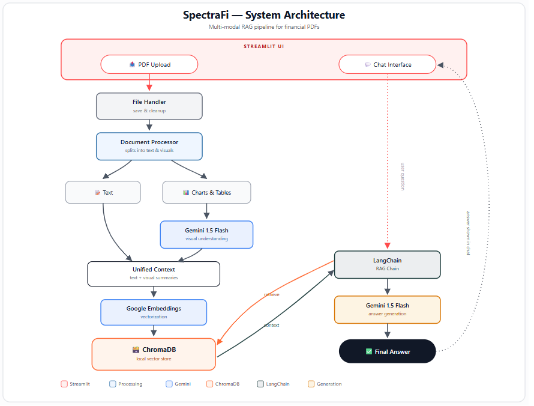
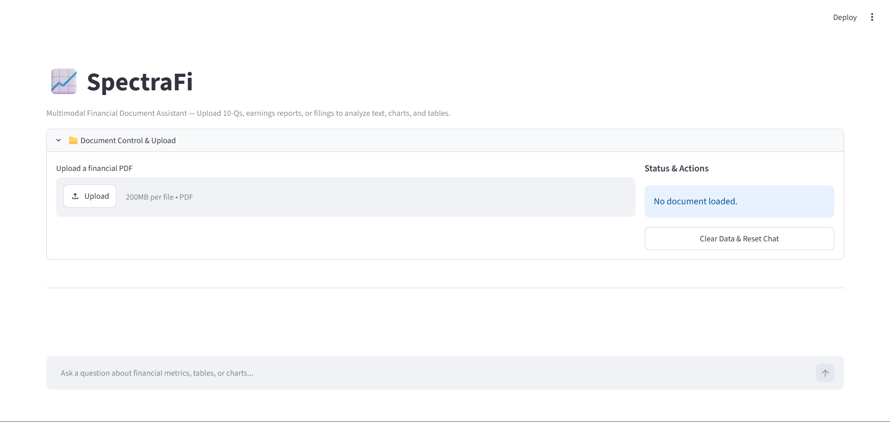
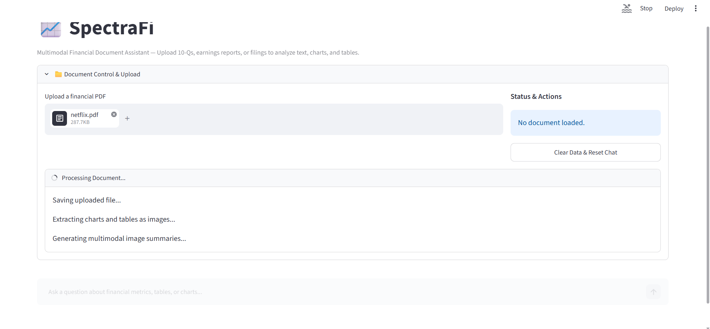
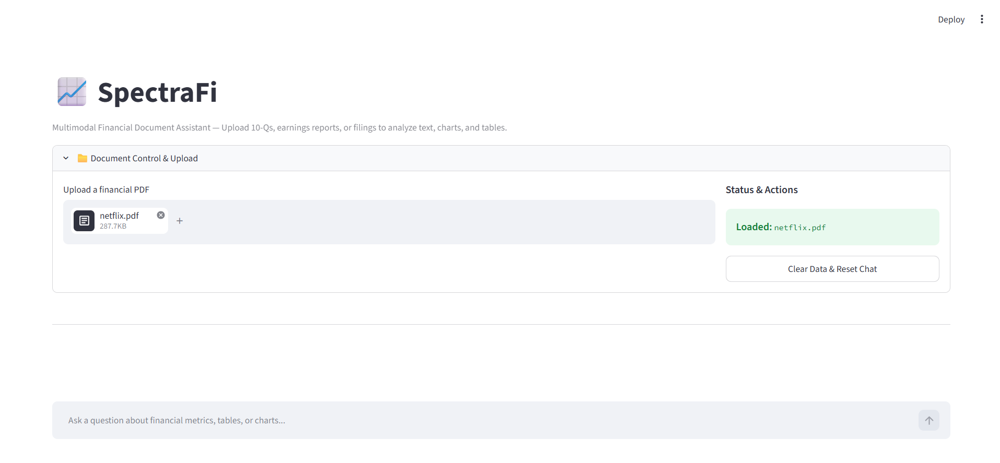
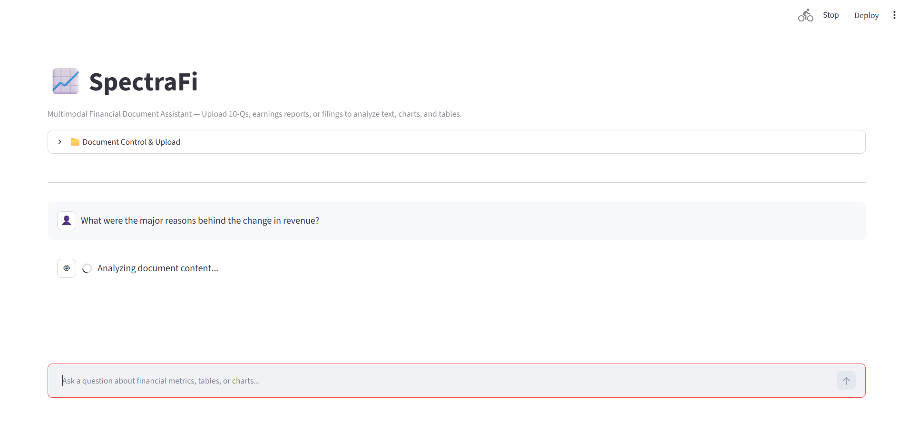
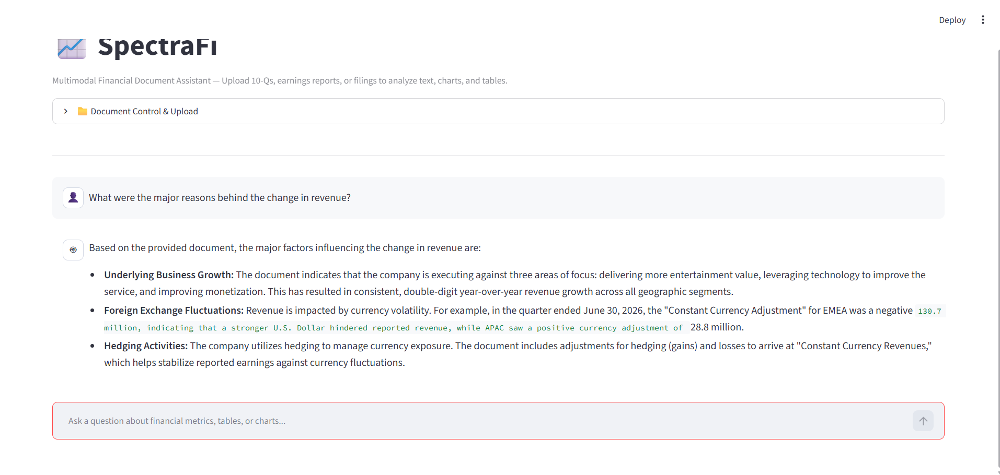

<div align="center">

# 📈 SpectraFi

**Chat with financial PDFs — text, charts, and tables included.**

A Multi-Modal RAG assistant that understands not just words, but the graphs and tables buried inside financial documents.


📄 Upload → 🧠 Understand → 🔎 Retrieve → 💬 Ask

</div>

---

## 📑 Table of Contents

- [Overview](#-overview)
- [Why SpectraFi?](#-why-spectrafi)
- [Features](#-features)
- [How It Works](#-how-it-works)
- [Architecture](#-architecture)
- [Repository Structure](#-repository-structure)
- [Tech Stack](#-tech-stack)
- [Getting Started](#-getting-started)
- [Installing Poppler](#-installing-poppler)
- [Screenshots](#-screenshots)
- [Example Questions](#-example-questions)
- [Limitations](#-limitations)
- [Security Notes](#-security-notes)
- [License](#-license)

---

## 📖 Overview

**SpectraFi** is a Retrieval-Augmented Generation (RAG) application built for financial documents. Most PDF chat tools only extract and search plain text — but earnings reports, 10-Q filings, and investor decks pack a huge share of their most important information into **charts, graphs, and tables**, which text-only pipelines quietly ignore.

SpectraFi closes that gap. It extracts the visual content from a PDF, runs it through **gemini-3.1-flash-lite** for understanding, and folds the resulting summaries into the same retrieval pipeline as the document's text — so questions get answered using the *whole* document, not just the paragraphs.

> **SpectraFi doesn't just read the document — it tries to understand the full picture.**

---

## ✨ Why SpectraFi?

A traditional text-only RAG system can retrieve the paragraphs near a chart, but it has no idea what the chart actually shows. If the answer to *"What drove the change in revenue?"* lives in a bar chart rather than a sentence, a text-only pipeline comes up empty.

| Capability | Traditional Text RAG | SpectraFi |
|---|:---:|:---:|
| PDF text retrieval | ✅ | ✅ |
| Semantic / vector search | ✅ | ✅ |
| Conversational Q&A | ✅ | ✅ |
| Charts & graphs understood | ⚠️ Limited | ✅ |
| Tables treated as visual content | ⚠️ Limited | ✅ |
| Multimodal (vision) understanding | ❌ | ✅ |

---

## 🚀 Features

| Feature | Description |
|---|---|
| 📄 **Dynamic PDF Upload** | Upload financial PDFs directly through the Streamlit interface |
| 🧩 **Multi-Modal RAG** | Combines textual retrieval with visual document understanding |
| 📊 **Chart & Table Extraction** | Pulls visual elements out of the PDF for further analysis |
| 👁️ **Visual Understanding** | gemini-3.1-flash-lite generates context-aware summaries of charts/tables |
| 🔎 **Semantic Retrieval** | Embeddings + ChromaDB power similarity search over the full context |
| 🧠 **RAG Question Answering** | Answers are grounded in retrieved document context, not guesswork |
| 💬 **Conversational Interface** | Ask multiple, follow-up questions about the same document |
| 💾 **Local Vector Storage** | ChromaDB keeps vector data local for the duration of the session |
| 🧹 **Session Cleanup** | Temporary files and vector data can be cleared from the UI |

---

## 🧠 How It Works

SpectraFi processes a document in six stages:

1. **📤 Upload** — the user drops a financial PDF into the Streamlit sidebar
2. **📑 Processing** — the PDF is split into text and extracted visual elements (charts, graphs, tables)
3. **👁️ Visual Understanding** — each extracted visual is passed to gemini-3.1-flash-lite, which generates a text summary of what it shows
4. **🧬 Vectorization** — text content and visual summaries are embedded with Google Generative AI Embeddings
5. **🔎 Retrieval** — a user's question is embedded and matched against the ChromaDB vector store
6. **🤖 Generation** — the retrieved context is passed through a LangChain RAG chain, and Gemini generates the final answer

```text
   Financial PDF
        │
   ┌────┴────┐
   ▼         ▼
 Text     Charts / Tables
   │            │
   │      Gemini Vision
   │            │
   │      Visual Summary
   │            │
   └─────┬──────┘
         ▼
   Unified Context
         │
         ▼
   Embeddings → ChromaDB
         │
         ▼
   Question → Similarity Search → Retrieved Context
         │
         ▼
   LangChain RAG Chain → Gemini → Answer
```

---

## 🏗️ Architecture



---

## 🗂️ Repository Structure

```text
SpectraFi/
│
├── src/
│   ├── __init__.py
│   ├── file_handler.py
│   ├── document_processor.py
│   └── rag_chain.py
│
├── app.py
├── requirments.txt
├── .gitignore
├── LICENSE
└── README.md
```

| File | Responsibility |
|---|---|
| `file_handler.py` | Manages uploaded files and cleanup operations |
| `document_processor.py` | Processes PDFs, extracts images, generates visual summaries, prepares embeddings |
| `rag_chain.py` | Implements the retrieval and answer-generation pipeline |
| `app.py` | Streamlit interface, session state, upload workflow, and chat UI |

---

## 🧰 Tech Stack

| Category | Technology | Purpose |
|---|---|---|
| 🐍 Language | Python 3.10+ | Core application development |
| 🎨 UI | Streamlit | Interactive web application |
| 🔗 LLM Framework | LangChain | RAG orchestration |
| 🤖 LLM | Gemini 3.1 Flash-Lite | Text generation + visual understanding |
| 🧬 Embeddings | Google Generative AI Embeddings | Semantic document representation |
| 🗄️ Vector Database | ChromaDB | Local vector storage and similarity search |
| 📄 PDF Processing | PyPDF | PDF text extraction |
| 🖼️ Image Processing | pdf2image | PDF-to-image conversion |
| 🖼️ Image Utilities | Pillow | Image handling |
| 🔐 Configuration | python-dotenv | Environment variable management |

---

## ⚙️ Getting Started

**Prerequisites:** Python 3.10+, `pip`, a Google Gemini API key, and Poppler installed on your system path.

```bash
# 1. Clone the repository
git clone https://github.com/yogeshsikhwal77/SpectraFi.git
cd SpectraFi

# 2. Create a virtual environment
python -m venv venv
source venv/bin/activate        # Windows: venv\Scripts\activate

# 3. Install dependencies
pip install -r requirments.txt
# Note: the repo currently uses "requirments.txt" as the filename

# 4. Configure your Gemini API key
echo "GEMINI_API_KEY=your_gemini_api_key_here" > .env
# Never commit this file — it should stay in .gitignore

# 5. Run the application
streamlit run app.py
```

The app opens in your browser. Upload a PDF from the sidebar and start asking questions once processing finishes.

---

## 🧩 Installing Poppler

SpectraFi uses `pdf2image`, which depends on **Poppler** to convert PDF pages into images. Install it before running the app.

**Windows**
1. Download the latest Poppler build from [oschwartz10612/poppler-windows](https://github.com/oschwartz10612/poppler-windows/releases)
2. Extract the archive somewhere permanent, e.g. `C:\poppler`
3. Add the `Library\bin` folder inside it (e.g. `C:\poppler\Library\bin`) to your **System PATH**
4. Restart your terminal and verify with `pdftoppm -h`

**macOS**
```bash
brew install poppler
```

**Linux (Debian/Ubuntu)**
```bash
sudo apt-get update
sudo apt-get install poppler-utils
```

**Linux (Fedora)**
```bash
sudo dnf install poppler-utils
```

Verify the install on any platform with:
```bash
pdftoppm -v
```

---

## 📸 Screenshots

<div style="display: flex; flex-wrap: wrap; justify-content: center; gap: 10px;">
  <!-- Top Row: Three Images -->
  <div style="flex: 1 1 30%; max-width: 30%; text-align: center;">
    
    <p>Comprehensive Financial Data Dashboard</p>
  </div>
  <div style="flex: 1 1 30%; max-width: 30%; text-align: center;">
    
    <p>Interactive PDF Upload Interface</p>
  </div>
  <div style="flex: 1 1 30%; max-width: 30%; text-align: center;">
    
    <p>Real-time Multi-Modal Analysis Status</p>
  </div>
</div>

<div style="display: flex; flex-wrap: wrap; justify-content: center; gap: 10px; margin-top: 20px;">
  <!-- Bottom Row: Two Images -->
  <div style="flex: 1 1 45%; max-width: 45%; text-align: center;">
    
    <p>Querying Across Text and Graphs</p>
  </div>
  <div style="flex: 1 1 45%; max-width: 45%; text-align: center;">
    
    <p>Detailed Financial Insight Report</p>
  </div>
</div>

---

## 💬 Example Questions

```text
"What were the major reasons behind the change in revenue?"
"Which segment showed the strongest growth?"
"What does the chart on revenue growth indicate?"
"Summarize the company's financial performance."
"What are the key changes compared with the previous period?"
```

---

## ⚠️ Limitations

SpectraFi is currently a learning / prototype application:

- Processing can be slow or costly for very large PDFs
- Visual extraction quality depends on the source PDF's formatting
- Gemini's interpretation of complex financial charts may not always be perfect
- Local ChromaDB is suited for experimentation, not large-scale deployment
- No authentication system yet
- **Not financial advice** — verify important answers independently

---

## 🔐 Security Notes

- API keys are managed via a local `.env` file (`GEMINI_API_KEY=...`) and must never be committed
- Do not commit credentials or private documents to the repository
- For production use, add authentication, file-size limits, input validation, rate limiting, and a production-grade vector database configuration

---

## 📄 License

Licensed under the [MIT License](./LICENSE).

---

<div align="center">

### 👨‍💻 Yogesh Sikhwal

Building at the intersection of **AI • Machine Learning • Deep Learning • Generative AI • Software Engineering**

[](https://github.com/yogeshsikhwal77)

⭐ If you find SpectraFi useful, consider starring the repo!

</div>